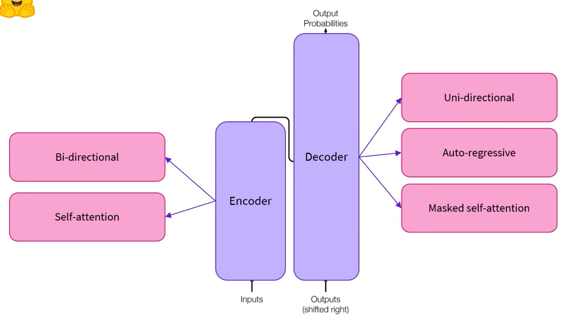
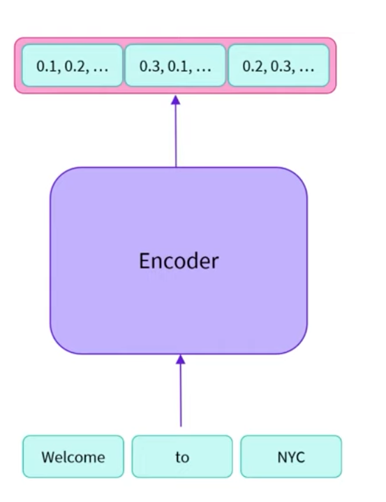
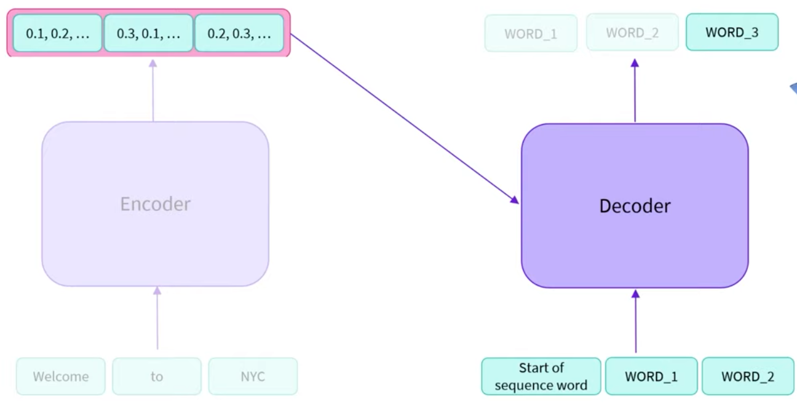
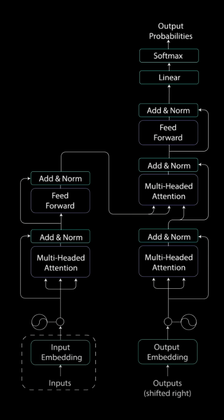
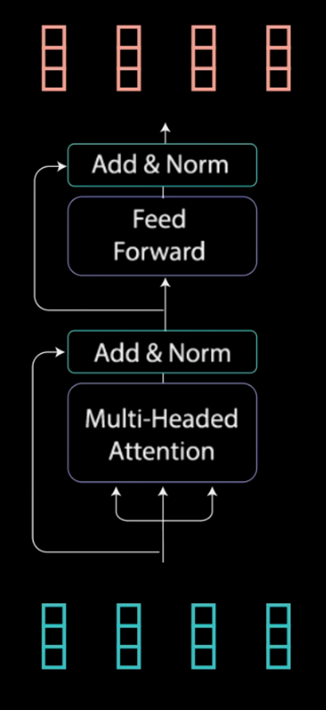
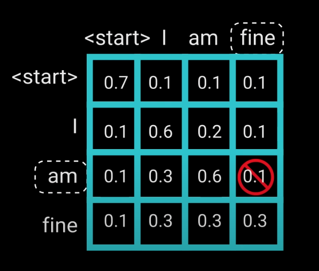
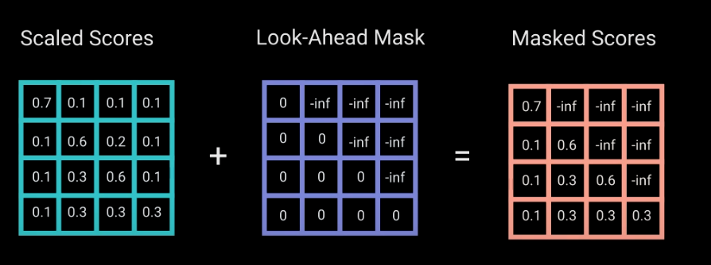
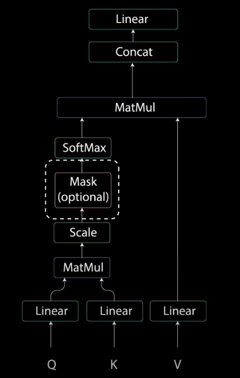
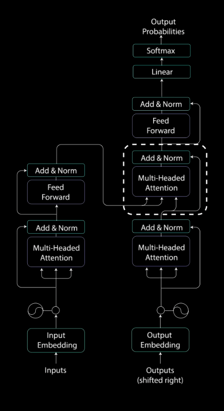
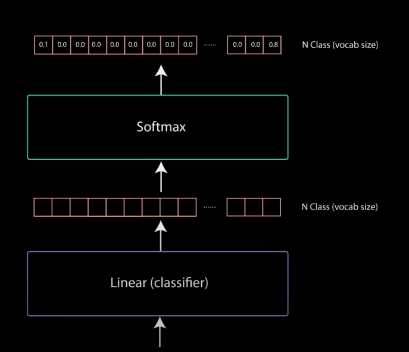

# Attention Is All You Need
https://arxiv.org/abs/1706.03762

# Overview

### Encoder

- Outputs a sequence of numbers per input word (feature vector or feature tensor)
    - The dimensions of the vector is defined by the architecture of the model (Base BERT 768)
    - Each word’s feature vector is a function of the word itself as well as the context (the words surrounding it)
    - The feature vector “holds the meaning of the word within the text”, which is the ************self-attention mechanism************

Use cases:

- Masked language modeling: predict hidden words within a sequence
- Sequence classification such as sentiment analysis

### Decoder

Similar to the encoder, the decoder creates a feature vector for each input word. Different from the encoder, the feature vectors for a word do not have the context from their right side—they are masked. 

- Decoders only have access to a single context, which is the **************************************************************masked self-attention mechanism**************************************************************
- Having only access to the left context, the decoder is good at text generation

### Encoder-Decoder Architecture

1. Encoder accepts a sequence as input and outputs the feature vectors
2. The decoder accepts the feature vectors and a “start of sequence token” to output a word
3. Decoder acts auto-regressively and outputs a word as an input 

# Model walk-through

## Transformer Encoder

### Input embedding

1. Each word maps to a vector with continuous values that represents that word
2. The positional information is injected into the embedding vectors with positional encoding
    1. Unlike RNNs, transformers don’t have a recurrence 
    
    Positional encoding:
    
    1. For every odd time-step create a positional encoding using the cosine function
    2. For every even time-step create a positional encoding using the sine function
    3. Add the positional encoding to each corresponding word embedding

### Encoder Layer

Map the positional input embeddings to the encoder representation of the input 

1. **[Multi-headed attention](https://youtu.be/4Bdc55j80l8?t=311)** computes the attention weights for the input and produces an output vector with encoded info about how each word should attend to all other words in a sequence 
2. Multi-headed attention output weights are added to the original input and go through a layer normalization
3. The values are then sent through a feed-forward network (Linear layer, ReLu activation, then 2nd linear layer). 
4. The feed-forward network outputs are added to its inputs and go through another layer of normalization

## Transformers Decoder

- Takes in its previous outputs as inputs and the encoder outputs (containing the attention information of the input).
- Decoder stops decoding when it generates an “end token” as an output

### Multi-headed attention layer 1

Computes the attentions score for the input of the decoder 

- Since the decoder is auto-regressive, you want to make sure the attention score is not done for future words. For example: when computing the attention for `am` in `I am fine`, you should not consider future words such as `fine`.
- To prevent the decoder from computing attention scores for future words, we use masking

******************************Look-ahead mask******************************

Following the mask, the softmax layer results in the `-inf` turning into `0` for the attention score 

### Multi-headed attention layer 2

Each multi-headed attention layer takes in a `query`, `key` and `value`. 

For this layer, the `value` and the `key` are from the *******encoder******* output and the `value` is from the output of the previous multi-headed attention layer in the *******decoder*******

This step matches the encoder’s input to the decoder’s input, allowing the decoder to decide which encoder’s input is relevant to put focus on

### Linear Classifier

This layer determines the probability of what the next word in the sequence will be

- Number of classes = number of words in the vocabulary
- Index of the softmax output with the highest probability score equals the predicted word

# Additional Resources Used

[[Into to] The Transformer architecture (HuggingFace)](https://www.youtube.com/watch?v=H39Z_720T5s&ab_channel=HuggingFace)

[Transformer models: Encoders (HuggingFace)](https://www.youtube.com/watch?v=MUqNwgPjJvQ&ab_channel=HuggingFace)

[Transformer models: Decoders (HuggingFace)](https://www.youtube.com/watch?v=d_ixlCubqQw&list=RDCMUCHlNU7kIZhRgSbhHvFoy72w&index=5&ab_channel=HuggingFace)

[Transformer models: Encoder-Decoders (HuggingFace)](https://www.youtube.com/watch?v=0_4KEb08xrE&list=RDCMUCHlNU7kIZhRgSbhHvFoy72w&index=7&ab_channel=HuggingFace)

[Illustrated Guide to Transformers Neural Network: A step by step explanation](https://www.youtube.com/watch?v=4Bdc55j80l8&ab_channel=TheA.I.Hacker-MichaelPhi)